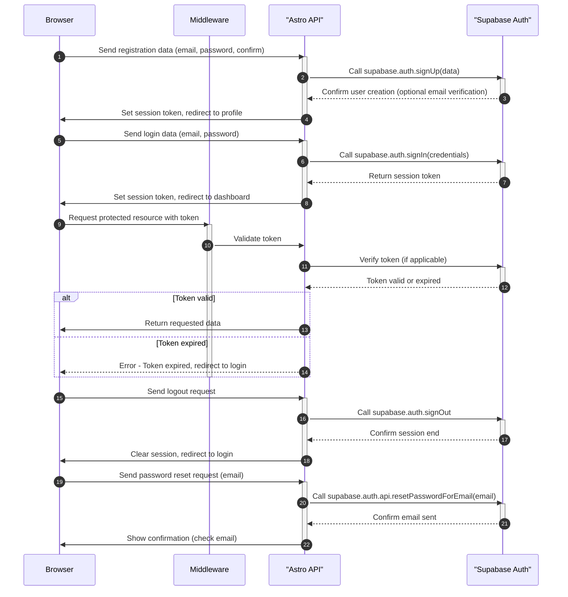

<authentication_analysis>

1. Przepływy autentykacji z dokumentacji PRD i AuthSpec:
   - Rejestracja: Użytkownik wysyła formularz rejestracji, dane są walidowane, Astro API wywołuje metodę supabase.auth.signUp, a w przypadku powodzenia użytkownik otrzymuje potwierdzenie oraz, opcjonalnie, e-mail weryfikacyjny. Następnie tworzona jest sesja i użytkownik jest przekierowywany do profilu.
   - Logowanie: Użytkownik wysyła formularz logowania, Astro API wywołuje metodę supabase.auth.signIn, a po poprawnym zalogowaniu tworzony jest token sesji, który jest przekazywany do przeglądarki i umożliwia dostęp do chronionych zasobów.
   - Wylogowanie: Użytkownik wysyła żądanie wylogowania, Astro API wywołuje metodę supabase.auth.signOut, co kończy sesję i czyści tokeny, a następnie następuje przekierowanie do strony logowania.
   - Reset hasła: Użytkownik wysyła żądanie resetu hasła, Astro API wywołuje metodę supabase.auth.api.resetPasswordForEmail, co inicjuje wysyłkę linku resetującego hasło na podany adres e-mail.
2. Główni aktorzy:
   - Browser: Interfejs użytkownika, wysyłający żądania autentykacyjne.
   - Middleware: Odpowiedzialny za weryfikację tokenów przy próbach dostępu do chronionych zasobów.
   - Astro API: Serwerowa warstwa odpowiedzialna za obsługę logiki autentykacji.
   - Supabase Auth: Usługa autoryzacji, która przeprowadza operacje rejestracji, logowania, wylogowania i resetu hasła.
3. Proces weryfikacji tokenów: Middleware przechwytuje żądania, weryfikuje token przez Astro API oraz, w razie potrzeby, konsultuje się z Supabase Auth. W przypadku wygaśnięcia tokenu, użytkownik jest przekierowywany na stronę logowania.
4. Opis kroków autentykacji:
   - Rejestracja: Dane rejestracyjne → Supabase Auth (signUp) → potwierdzenie i ewentualna weryfikacja e-mailem → utworzenie sesji i przekierowanie.
   - Logowanie: Dane logowania → Supabase Auth (signIn) → utworzenie sesji (token) → dostęp do chronionych zasobów.
   - Wylogowanie: Żądanie wylogowania → Supabase Auth (signOut) → zakończenie sesji → przekierowanie na stronę logowania.
   - Reset hasła: Żądanie resetu → Supabase Auth (resetPasswordForEmail) → wysłanie linku resetującego.

</authentication_analysis>

##

