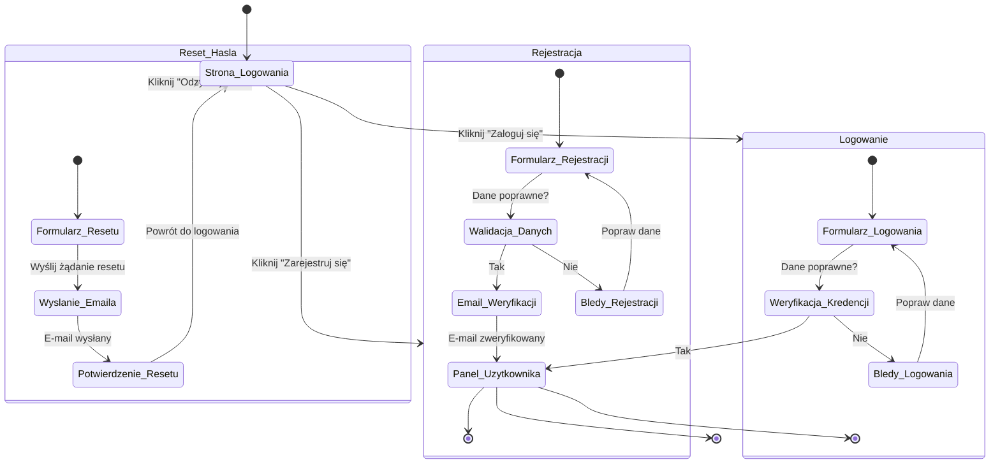

<user_journey_analysis>
1. Ścieżki użytkownika:
   - Użytkownik wchodzi na stronę logowania jako niezalogowany.
   - Z ekranu logowania może przejść do:
     a) Logowania (jeśli posiada konto),
     b) Rejestracji (dla nowych użytkowników),
     c) Resetu hasła (jeśli zapomniał hasła).
2. Główne podróże i stany:
   - Strona logowania: punkt wejścia dla niezalogowanych użytkowników.
   - Formularz logowania: gdzie użytkownik wprowadza swoje dane i przesyła je do systemu.
   - Proces logowania: weryfikacja danych; po sukcesie – przejście do panelu użytkownika, w przypadku błędu – powrót do formularza.
   - Formularz rejestracji: dla nowych użytkowników, zawiera wstępną walidację danych.
   - Proces rejestracji: walidacja danych, ewentualna weryfikacja maila i utworzenie konta, a następnie automatyczne logowanie.
   - Formularz resetu hasła: użytkownik wpisuje adres e-mail, co inicjuje wysyłkę linku resetującego.
3. Punkty decyzyjne:
   - W procesie logowania: decyzja na podstawie poprawności danych (poprawne lub błędne dane).
   - W procesie rejestracji: czy dane są poprawne, a następnie czy e-mail został zweryfikowany.
4. Opis stanów:
   - Strona_Logowania: Ekran, gdzie użytkownik wybiera akcję (Logowanie, Rejestracja, Reset hasła).
   - Logowanie: Proces weryfikacji danych logowania.
   - Rejestracja: Proces tworzenia nowego konta, z opcjonalną weryfikacją maila.
   - Reset_Hasla: Proces inicjowania resetu hasła i wysyłki odpowiedniego emaila.
   - Panel_Uzytkownika: Stan końcowy, gdzie użytkownik uzyskuje pełny dostęp po autoryzacji.
</user_journey_analysis>

