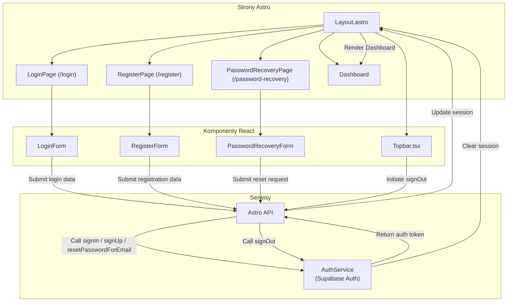

<architecture_analysis>

1. Komponenty:
   - Layout.astro: Główny layout w Astro, odpowiedzialny za renderowanie stron w zależności od stanu autentykacji.
   - Topbar.tsx: Komponent React, zawiera nawigację oraz przycisk wylogowania.
   - LoginPage (/login): Strona logowania renderowana przez Astro, zawiera komponent LoginForm do wprowadzania danych logowania.
   - RegisterPage (/register): Strona rejestracji renderowana przez Astro, zawiera komponent RegisterForm do tworzenia konta.
   - PasswordRecoveryPage (/password-recovery): Strona resetu hasła, zawiera komponent PasswordRecoveryForm do inicjowania resetu hasła.
   - AuthService: Moduł (np. w src/lib/services) odpowiedzialny za komunikację z Supabase Auth, wykorzystujący metody signUp, signIn, signOut oraz resetPasswordForEmail.
   - Astro API: Endpointy API w Astro realizujące logikę autentykacji, przekazujące żądania do AuthService.
2. Strony i komponenty:
   - Strony: LoginPage, RegisterPage, PasswordRecoveryPage, Dashboard (panel użytkownika).
   - Komponenty React: LoginForm, RegisterForm, PasswordRecoveryForm oraz Topbar.tsx.
3. Przepływ danych:
   - Formularze w poszczególnych stronach przesyłają dane do Astro API, które wywołuje AuthService.
   - Na podstawie odpowiedzi (np. tokenu sesji) Layout.astro aktualizuje widok i sesję użytkownika, przekierowując go do Dashboard.
   - Topbar.tsx umożliwia wylogowanie, wywołując proces signOut, co czyści sesję.
4. Funkcjonalność:
   - Layout.astro: Decyduje, które strony i komponenty renderować w zależności od stanu autentykacji.
   - Topbar.tsx: Umożliwia nawigację i oferuje opcję wylogowania.
   - Formularze (LoginForm, RegisterForm, PasswordRecoveryForm): Zbierają dane użytkownika i inicjują działania autentykacyjne.
   - AuthService: Obsługuje logikę autentykacji przy użyciu Supabase Auth.

</architecture_analysis>

